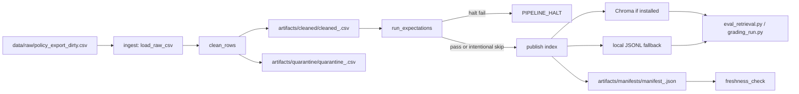

# Pipeline Architecture - Lab Day 10

**Group:** 2A202600682 - Nguyen Tai Khoa  
**Last updated:** 2026-06-10  
**Final clean run_id:** `clean-final`

## 1. Flow

`run_id` is logged at the start of every run and copied into the manifest. Freshness is measured after publish from `latest_exported_at`.

## 2. Component Boundaries

| Component | Input | Output | Owner |
|---|---|---|---|
| Ingest | raw CSV export | list of raw rows, `raw_records` log | Ingestion owner |
| Transform | raw rows | cleaned rows and quarantine rows | Cleaning owner |
| Quality | cleaned rows | halt/warn expectation results | Quality owner |
| Publish | cleaned CSV | Chroma collection or `artifacts/index/local_index.jsonl` | Embed owner |
| Monitor | manifest | PASS/WARN/FAIL freshness result | Monitoring owner |

## 3. Idempotency

Chroma mode upserts by stable `chunk_id` and prunes IDs not present in the current cleaned snapshot. Local fallback mode rewrites one JSONL snapshot on each run, so reruns do not accumulate stale chunks.

## 4. Day 09 Link

Day 09 workers rely on the same CS and IT Helpdesk knowledge base. Day 10 owns the upstream data contract: only cleaned, validated, current chunks should feed retrieval before the Day 09 supervisor routes questions.

## 5. Known Risks

- This environment did not have `chromadb`, so the final verification used the local JSONL fallback.
- Sample `exported_at` values are from April 2026, so freshness correctly fails against the default 24 hour SLA on 2026-06-10.
